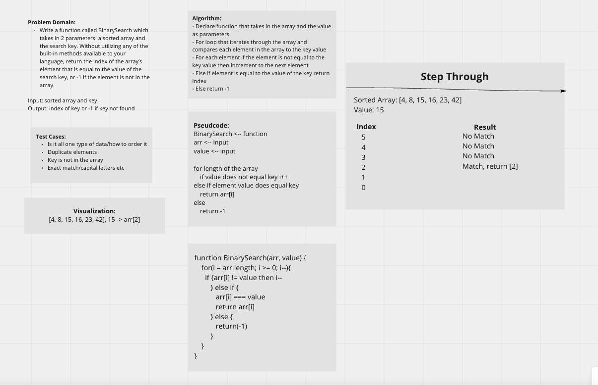

# Data Structures and Algorithms

## Table of Contents

*

## Code Challenges

### 401 Data Structures, Code Challenges

#### **Code Challenge 01 Reverse an Array**

---

- Write a function called `reverseArray` which takes an array as an argument. Without utilizing any of the built-in methods available to your language, return an array with elements in reversed order.

#### Whiteboard Process

- 

#### Approach and Efficiency

- Today was a group code challenge completed by our instructor, [Ryan Gallaway](https://github.com/rkgallaway).  It was my first experience with whiteboarding, and I really appreciated the instruction.  The whiteboard provided above was done entirely by Mr. Gallaway during instruction.

#### **Code Challenge 02 Array Insert Shift**

---

- Write a function called `insertShiftArray` which takes in an array and a value to be added. Without utilizing any of the built-in methods available to your language, return an array with the new value added at the middle index.

#### Whiteboard Process

- 

#### Approach and Efficiency

- Today I worked with [Brandon Pitts](https://github.com/brandomoki) on the the code challenge.  We started the challenge with coding out in replit using a a for-loop to iterate through the array, it insert an elenemt into the middle of the array.  We then worked though the whiteboard process.  Being our first time doing this I think we worked well together getting through the asignment.  We spent more time than we expected, but being the first time for both of of us, I think we made the most of our time.

#### **Code Challenge 03 Binary Search**

---

- Write a function called BinarySearch which takes in 2 parameters: a sorted array and the search key. Without utilizing any of the built-in methods available to your language, return the index of the array’s element that is equal to the value of the search key, or -1 if the element is not in the array.

#### Whiteboard Process

- 

#### Approach and Effecientcy

- Today I worked with [Stephanie Hill](https://github.com/stephnitis) and [Mandela Steele-Dadzie](https://github.com/msteeledadzie422) on the Binary Search Code Challenge.  We started of by deciding to use Miro as our whiteboard, which Stephanie worked out for the team.  Next went went over the assignment instrcuctions and began working through our white board following the example given to us in the assignment. Once we got to the psuedo or code section we diced to put both buecause we weren't entirely sure our code was correct.  Working in a team of 3 was helpful because there were more ideas being thrown around and that was helpful.  Stephanie and Mandela were great and very knowledgeable.

#### Code challenge-Linked List

----

## Challenge

**Node**

* Create a Node class that has properties for the value stored in the Node, and a pointer to the next Node.

**Linked List**

* Create a Linked List class

* Within your Linked List class, include a head property.
Upon instantiation, an empty Linked List should be created.

* The class should contain the following methods
insert
  * Arguments: value
  * Returns: nothing
  * Adds a new node with that value to the head of the list with an O(1) Time performance.

* includes
  * Arguments: value
  * Returns: Boolean

    * Indicates whether that value exists as a Node’s value somewhere within the list.

* to string
  * Arguments: none

  * Returns: a string representing all the values in the Linked List,formatted as:

  * "{ a } -> { b } -> { c } -> NULL"

**Structure and Testing**

* Utilize the Single-responsibility principle: any methods you write should be clean, reusable, abstract component parts to the whole challenge. You will be given feedback and marked down if you attempt to define a large, complex algorithm in one function definition.

* Be sure to follow your language/frameworks standard naming conventions (e.g. C# uses PascalCasing for all method and class names).

* Any exceptions or errors that come from your code should be contextual, descriptive, capture-able errors. For example, rather than a default error thrown by your language, your code should raise/throw a custom error that describes what went wrong in calling the methods you wrote for this lab.

* Write tests to prove the following functionality:

  * Can successfully instantiate an empty linked list
  * Can properly insert into the linked list
  * The head property will properly point to the first node in the linked list
  * Can properly insert multiple nodes into the linked list
  * Will return true when finding a value within the linked list that exists
  * Will return false when searching for a value in the linked list that does not exist
  * Can properly return a collection of all the values that exist in the linked list
* Ensure your tests are passing before you submit your solution.

## Approach and Efficientcy

  I took the time to rewatch the lecture.  I tried to follow along and write out my code.  I cant get my tests to run I keep getting `err` file not found.  I've worked on this for about 4 hours

