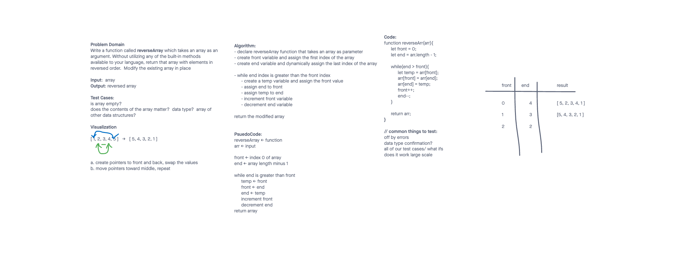
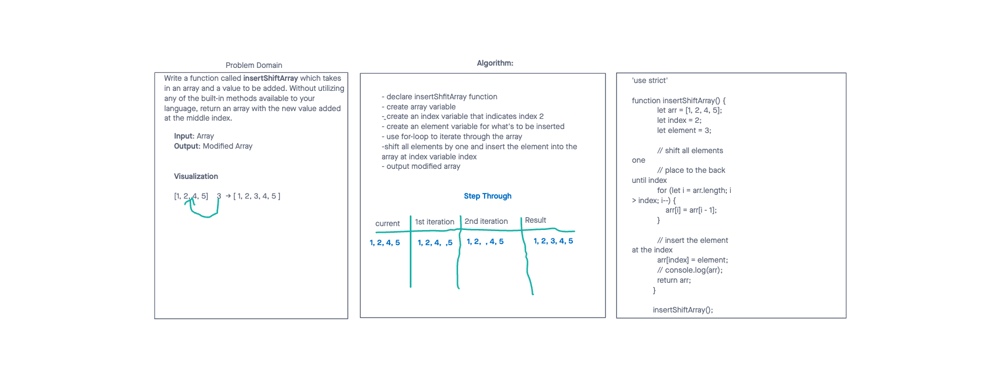

# Data Structures and Algorithms

See [setup instructions](https://codefellows.github.io/setup-guide/code-301/3-code-challenges), in the Code 301 Setup Guide.

## Repository Quick Tour and Usage

### 301 Code Challenges
****

Under the `javascript` folder, at the top level, is a sub-folder called `code-challenges`

Each day, you'll add one new file to this folder to do your work for the day's assigned code challenge

If you have not already done so, run `npm install` from within this folder to setup your system to be able to run tests using `Jest`

To run your tests

- Change to the `javascript` folder
- run `npm test` to run all of the tests
- run `npm test ##` to only run tests for challenge ## (i.e. 01)

### 401 Data Structures, Code Challenges

****

#### **Code Challenge 01 Reverse an Array**

- Write a function called `reverseArray` which takes an array as an argument. Without utilizing any of the built-in methods available to your language, return an array with elements in reversed order.

#### Whiteboard Process

- 

#### Approach and Efficiency

- Today was a group code challenge completed by our instructor, [Ryan Gallaway](https://github.com/rkgallaway).  It was my first experience with whiteboarding, and I really appreciated the instruction.  The whiteboard provided above was done entirely by Mr. Gallaway during instruction.

#### **Code Challenge 01 Array Insert Shift**

- Write a function called `insertShiftArray` which takes in an array and a value to be added. Without utilizing any of the built-in methods available to your language, return an array with the new value added at the middle index.

#### Whiteboard Process

- 

#### Approach and Efficiency

- Today I worked with [Brandon Pitts](https://github.com/brandomoki) on the the code challenge.  We started the challenge with coding out in replit using a a for-loop to iterate through the array, it insert an elenemt into the middle of the array.  We then worked though the whiteboard process.  Being our first time doing this I think we worked well together getting through the asignment.  We spent more time than we expected, but being the first time for both of of us, I think we made the most of our time.
